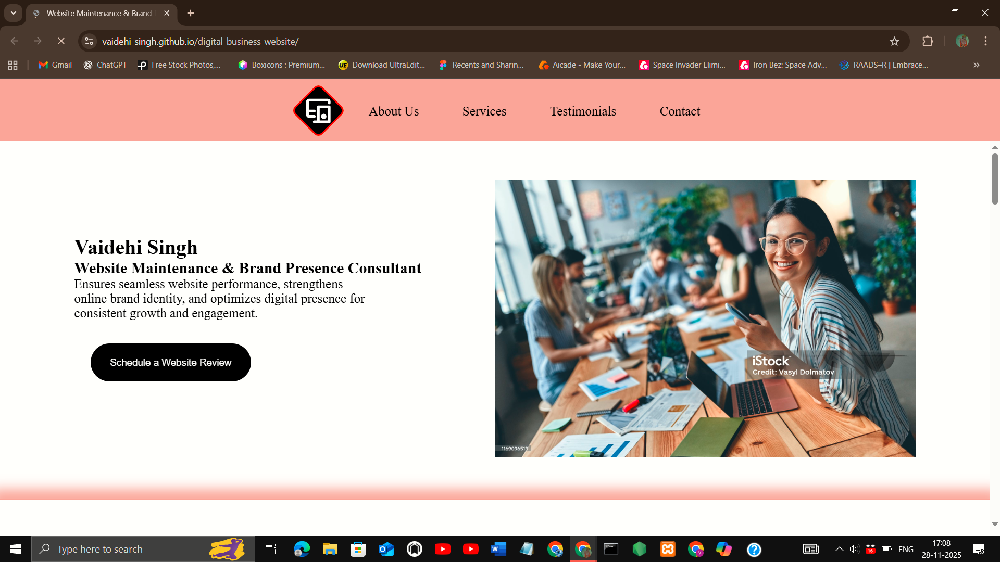
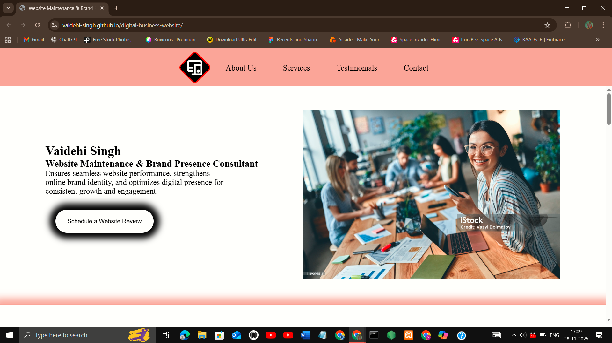
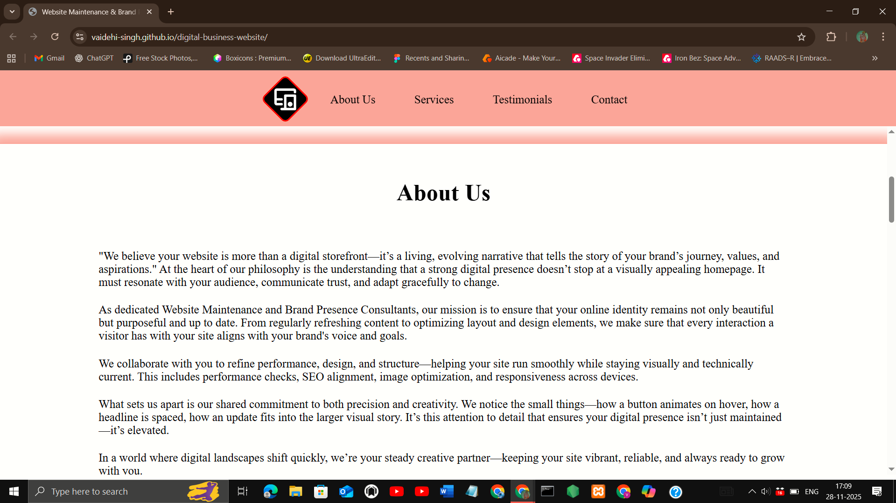
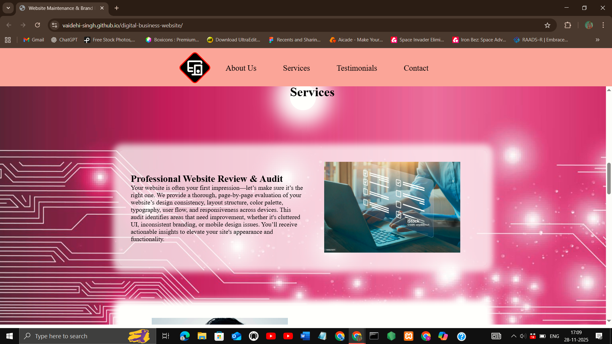
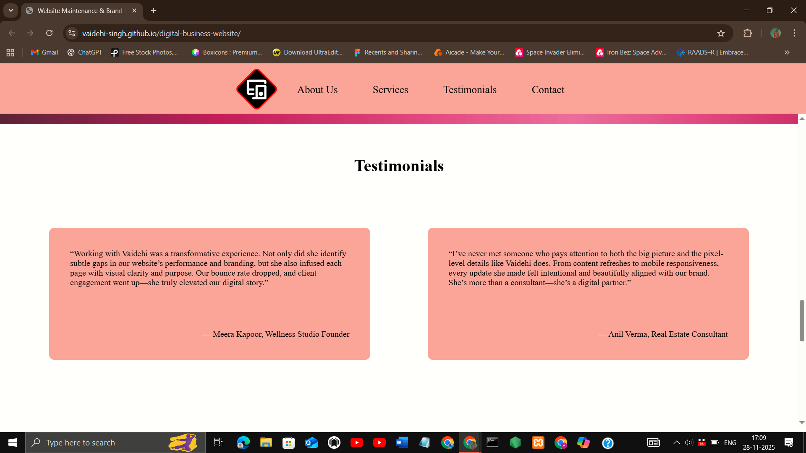
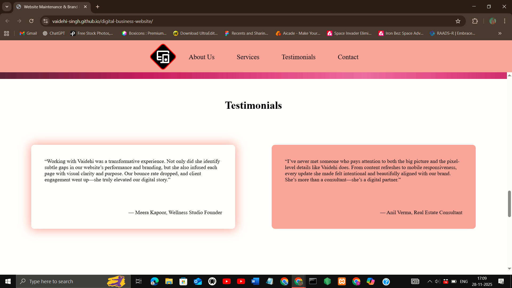
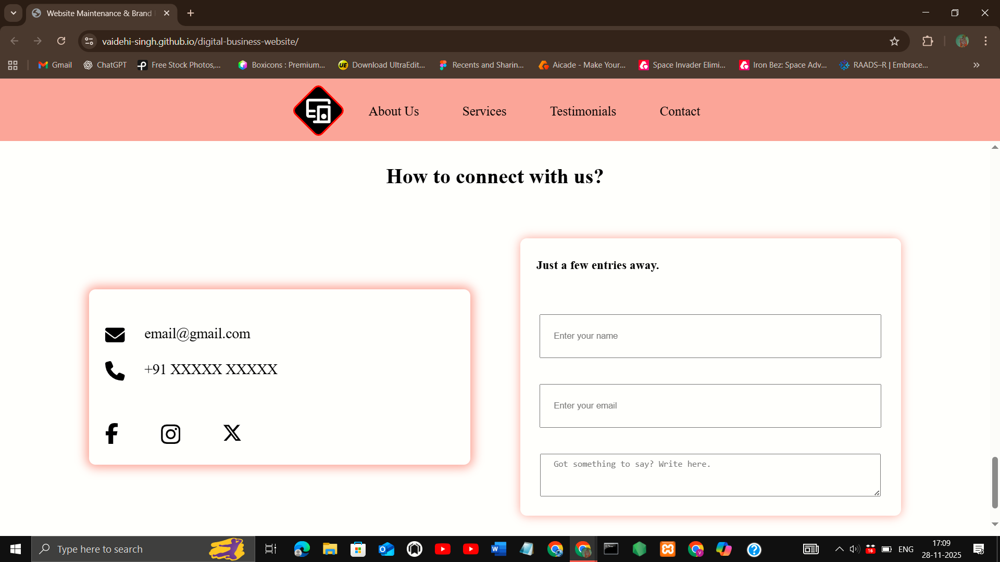

## Project Title
Social Media Share button

## Description
A responsive digital business website using HTML, CSS, and JavaScript, designed by me. It features smooth transitions, modern layouts, and adapts seamlessly across mobile, tablet, and desktop devices, presenting services and brand identity with a professional, user‑friendly experience.

## Features
- Responsive design (mobile, tablet, desktop)
- Smooth transitions and animations
- Clean, modern UI
- Interactive hover effects
- Designed by me.

## Demo
[Live Demo](https://vaidehi-singh.github.io/digital-business-website/)

## Screenshots








## Tech Stack
- HTML
- CSS
- JavaScript

## How to Use
 1. Clone the repo  
   ```bash
   git clone https://github.com/vaidehi-singh/digital-business-website.git
   cd digital-business-website
   ```
 2. Open index.html in your browser.

## Author
Designed and developed by **Vaidehi Singh**  
[GitHub Profile](https://github.com/vaidehi-singh)
